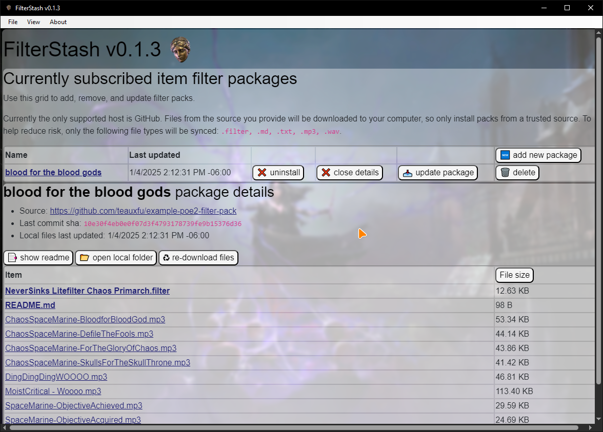
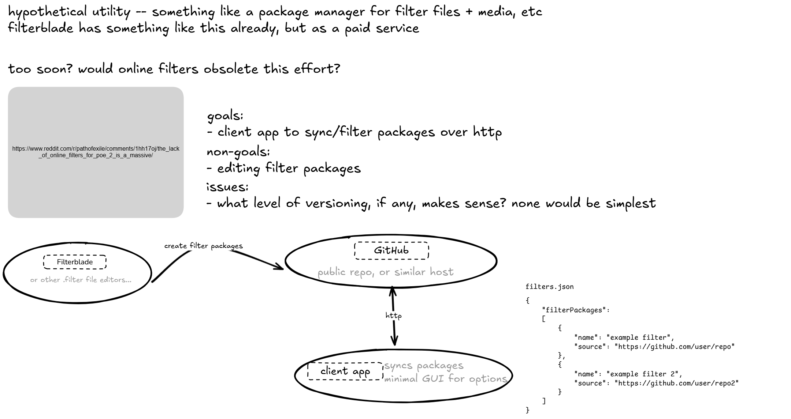

# FilterStash

This is a prototype desktop utility for syncing PoE2 filter packages.

## Todos
- winforms DI https://www.wiktorzychla.com/2022/01/winforms-dependency-injection-in-net6.html#google_vignette
 
## Developing

The app targets .NET 9 on Windows 10+ only. The UI is implemented in Blazor and deployed througha MAUI desktop shell. The installer is packaged using an Inno setup script. Releases are to be hosted on GitHub.

### Changelog 

#### v0.1.4 2025-01-04
initial prototype release 

#### prototype
- 2025-01-03 compressed wallpapers, added crude-auto-update
- 2025-01-03 packaging/deployment
- 2024-12-31 playing with ui, added native Windows menu, considering if MudBlazor is needed
	- still deliberating on what to do for data persistence. either json or sqlite via efcore
	- stealing some graphics from https://www.cameronsworld.net/
- 2024-12-30 toying with deployment methods, settled on MAUI Blazor with installs via InnoSetup
- 2024-12-29 initial scaffolding, connecting Octokit, etc.