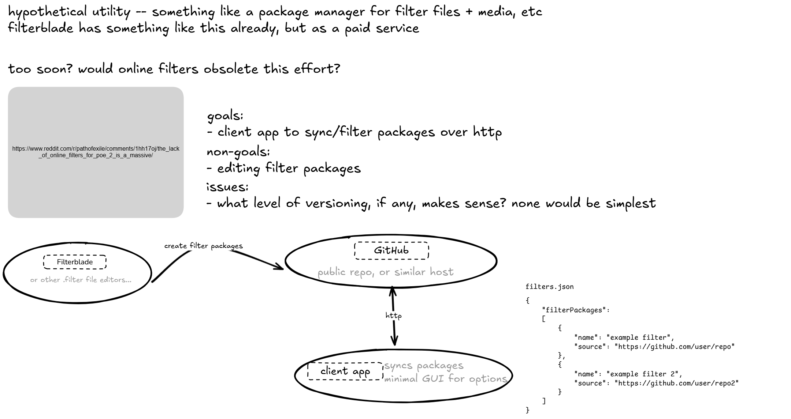
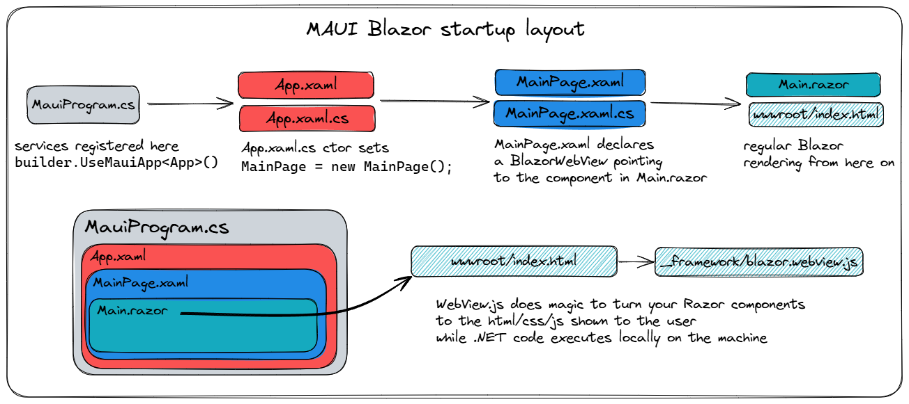

# FilterStash

This is a prototype desktop utility for syncing PoE2 filter packages.

added inno setup for the installer
tried packaging in winforms to see if it would be easier, it wasn't -- static assets can't be served from an RCL in winforms apparently

## Todos
- ui lib, mudblazor or something?
- app db for storing hashes and such?
	- https://learn.microsoft.com/en-us/dotnet/maui/data-cloud/database-sqlite?view=net-maui-9.0
	- https://www.reddit.com/r/dotnetMAUI/comments/13j65uk/efcore_vs_sqlite_sqlitenetpcl/
	- https://www.reddit.com/r/dotnet/comments/vsjmjh/ef_core_with_sqlite_worth_the_effort/?rdt=62904
-  other wallpapers
- winforms DI https://www.wiktorzychla.com/2022/01/winforms-dependency-injection-in-net6.html#google_vignette
 
## Developing

The app targets .NET 9 on Windows 10+ only. The UI is implemented in Blazor and deployed througha MAUI desktop shell. The installer is packaged using an Inno setup script. Releases are to be hosted on GitHub.

### Changelog 

#### prototype
- 2024-12-29 initial scaffolding, connecting Octokit, etc.
- 2024-12-30 toying with deployment methods, settled on MAUI Blazor with installs via InnoSetup
- 2024-12-31 playing with ui, added native Windows menu, considering if MudBlazor is needed
	- still deliberating on what to do for data persistence. either json or sqlite via efcore
	- stealing some graphics from https://www.cameronsworld.net/